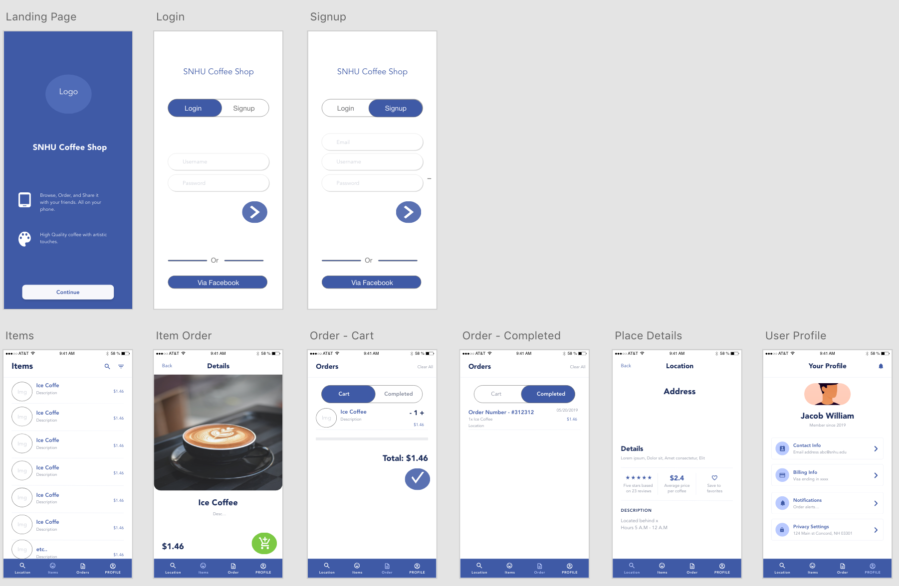
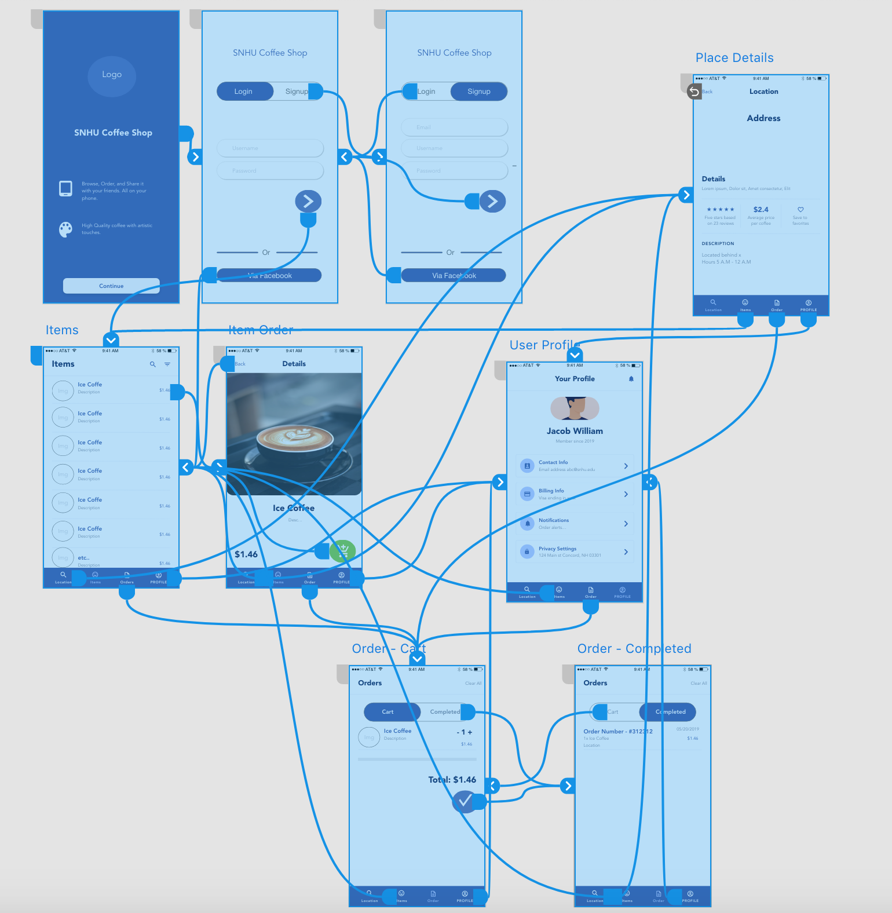

# Local Coffee Shops ☕️☕️
CS-360 Class. This project is one of the project that I'm currently working on to implement a system of a franchise coffee shop app that lets user order, track orders. login, and set payments. The language I'll be using is Kotlin after Google recommending all Android devs to switch from Java to Kotlin. 

# Mockup

<h1 align="center">
</h1>

# Wireframe
<h1 align="center">
</h1>
